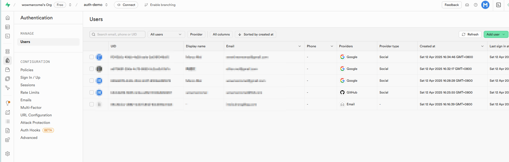

# Supabase Auth Demo with Next.js

This is a [Next.js](https://nextjs.org/) project that demonstrates authentication using [Supabase](https://supabase.com/), including email/password, GitHub, and Google authentication methods.

## Demo

1. Home Page

   

2. Login Page

   

3. Login with Google

   

4. User Profile

   

5. Users in Supabase

   

## Getting Started

First, clone the repository and install the dependencies:

```bash
git clone https://github.com/wowmarcomei/my-supabase-auth-app.git
cd my-supabase-auth-app
npm install
```

Next, create a `.env.local` file in the root directory with the following variables:

```
NEXT_PUBLIC_SUPABASE_URL=your-supabase-project-url
NEXT_PUBLIC_SUPABASE_ANON_KEY=your-supabase-anon-key
NEXT_PUBLIC_SITE_URL=http://localhost:3000
```

You can get these values from your Supabase project settings.

Then, run the development server:

```bash
npm run dev
```

Open [http://localhost:3000](http://localhost:3000) with your browser to see the result.

## Setting Up Supabase Authentication

### 1. Create a Supabase Project

1. Go to [Supabase](https://supabase.com/) and sign up or log in
2. Create a new project
3. Once your project is created, go to the project settings and copy the URL and anon key to your `.env.local` file

### 2. Configure Authentication Providers

#### Email/Password Authentication

1. In your Supabase dashboard, go to Authentication > Settings
2. Make sure "Email" provider is enabled

#### GitHub Authentication

1. Go to [GitHub Developer Settings](https://github.com/settings/developers)
2. Click on "New OAuth App"
3. Fill in the following details:
   - Application name: Your app name
   - Homepage URL: `http://localhost:3000`
   - Authorization callback URL: `https://your-supabase-project.supabase.co/auth/v1/callback`
4. Register the application and copy the Client ID
5. Generate a new Client Secret and copy it
6. In your Supabase dashboard, go to Authentication > Providers > Github
7. Enable GitHub provider and paste the Client ID and Client Secret
8. Save the changes

#### Google Authentication

1. Go to [Google Cloud Console](https://console.cloud.google.com/)
2. Create a new project or select an existing one
3. Go to "APIs & Services" > "Credentials"
4. Click "Create Credentials" and select "OAuth client ID"
5. For the application type, select "Web application"
7. Add `https://your-supabase-project.supabase.co/auth/v1/callback` as an authorized redirect URI
8. Create the client and copy the Client ID and Client Secret
9. In your Supabase dashboard, go to Authentication > Providers
10. Enable Google provider and paste the Client ID and Client Secret
11. Save the changes

## Project Structure

- `src/app`: Main application code using Next.js App Router
- `src/app/page.tsx`: Home page
- `src/app/dashboard/page.tsx`: Dashboard page (protected route)
- `src/app/auth/login/page.tsx`: Login page
- `src/app/auth/callback/route.ts`: Authentication callback handler
- `src/app/auth/logout/route.ts`: Logout handler
- `src/lib/supabase.ts`: Supabase client for client-side operations
- `src/lib/supabase-server.ts`: Supabase client for server-side operations
- `src/middleware.ts`: Next.js middleware for authentication

## Features

- Email/password authentication
- Social login with GitHub and Google
- Protected routes
- User profile display
- Session management

## Learn More

To learn more about Next.js and Supabase, take a look at the following resources:

- [Next.js Documentation](https://nextjs.org/docs) - learn about Next.js features and API.
- [Supabase Documentation](https://supabase.com/docs) - learn about Supabase features.
- [Supabase Auth Helpers for Next.js](https://supabase.com/docs/guides/auth/auth-helpers/nextjs) - learn about Supabase Auth Helpers.

## Deploy on Vercel

The easiest way to deploy your Next.js app is to use the [Vercel Platform](https://vercel.com/new?utm_medium=default-template&filter=next.js&utm_source=create-next-app&utm_campaign=create-next-app-readme) from the creators of Next.js.

When deploying to Vercel, make sure to add the environment variables in the Vercel project settings.

## License

This project is open source and available under the [MIT License](LICENSE).
